<h1 align="center">Allen Xavier</h1>

  <b>AI Software Engineer</b> · Architecting AI systems that run in production
   
  WineConX · Berlin, Germany

  
  
  
  

---

## What I do

I design and build the AI systems behind a production platform: agent architectures, the
domain models they operate on, and the infrastructure that runs them.

Four products at [WineConX](https://wineconx.app) share one platform, layered as **entry →
agents → domain → adapters → infrastructure**. Agents sit above the domain and never below
it, so an agent can be rewritten without the business logic noticing. Providers sit at the
edge behind adapters, so changing a model is a configuration change rather than a migration.

| System | What it does |
| --- | --- |
| **Agent-orchestrated media house** | A director agent delegates to script writer, photographer and cinematographer agents, producing publishable copy, imagery and video end to end |
| **Automated destination desk** | A profile agent reads the conversation, a planner builds the itinerary, a booking agent routes each activity to a provider. Activities move `pending → confirmed` or `cancelled` |
| **Demand-driven instance automation** | Terraform provisions and de-provisions instances against workflow demand, robust enough to run unattended |
| **AI SEO** | Structuring sites so answer engines retrieve and cite them correctly, not only so crawlers rank them |

Before that, two years of applied research at FZI on multimodal LLM systems and graph
neural networks, published at IEEE ITSC.

---

## Stack

**Models & providers**

**Agents & retrieval**

**Backend & data**

**Infrastructure**

<b>Machine learning and embedded foundations</b>

 

---

## Languages

<picture>
  <source media="(prefers-color-scheme: dark)" srcset="./assets/languages-dark.svg">
  
</picture>

---

## Selected work

| Repository | What it is |
| --- | --- |
| [**latentsync_turbo**](https://github.com/xavierallem/latentsync_turbo) | Inference optimisation for LatentSync, an audio-conditioned latent diffusion model for lip sync. 4/8-bit Whisper quantisation, DPM-Solver, Flash Attention 2, within 8GB VRAM |
| [**helpai**](https://github.com/xavierallem/helpai) | Local RAG for legal document Q&A. Hybrid retrieval over dense embeddings, BM25 and a cross-encoder reranker, with source citations. FastAPI, Ollama, ChromaDB, LangChain |
| [**dynamic_agent_perception**](https://github.com/xavierallem/dynamic_agent_perception) | OpenCOOD fork: dynamic agent selection for collaborative perception, cutting V2V bandwidth with a RANSAC ground-truth filter |
| [**picoVision**](https://github.com/xavierallem/picoVision) | Edge AI vision assistant on a Raspberry Pi Pico, real-time recognition with voice feedback |
| [**SMOLES-Firmware**](https://github.com/xavierallem/SMOLES-Firmware) | Wearable posture monitoring with on-device ML. Best Product Award, KIT Student Innovation Lab |
| [**esp8266-Edge-ML**](https://github.com/xavierallem/esp8266-Edge-ML) | ML framework for the ESP8266 with memory and power constraints in mind |
| [**ArduinoMLib**](https://github.com/xavierallem/ArduinoMLib) | Lightweight ML primitives for Arduino |
| [**Speech-Recognition-ES**](https://github.com/xavierallem/Speech-Recognition-ES) | Embedded speech recognition with DFT-based real-time audio processing |

---

## Publications

- **EffiComm: Bandwidth Efficient Multi-Agent Communication** · IEEE ITSC 2025 · [arXiv](https://arxiv.org/abs/2507.19354)
   Graph neural networks with a mixture-of-experts architecture cut V2V perception bandwidth from 11.64MB to 1.90MB, an 83.7% reduction, holding 92% detection accuracy.
- **Patient Monitoring & Assisting System** · IEEE ICCST 2022 · [IEEE Xplore](https://ieeexplore.ieee.org/abstract/document/10040443)
- **Unknown Terrain Modelling using 3D Mapping** · ICCMC 2021 · [IEEE Xplore](https://ieeexplore.ieee.org/abstract/document/9418346)

---

## Experience

| Period | Role |
| --- | --- |
| Mar 2026 – Present | **AI Software Engineer** · WineConX, Berlin |
| Mar 2024 – Feb 2026 | **Research Assistant** · FZI Research Centre, Karlsruhe Multimodal LLM agents for UX evaluation: 3.2× throughput, 22% fewer hallucinations via RAG and QLoRA, served on vLLM, deployed on Kubernetes |
| Nov 2024 – May 2025 | **Master's Thesis, EffiComm** · FZI Research Centre |
| Feb 2023 – Mar 2024 | **Software Developer (Werkstudent)** · Vanory, Karlsruhe |
| Jan 2023 – Jan 2024 | **Software Developer (HiWi)** · RITA Project, Karlsruhe |
| 2021 – 2022 | Gupshup · Life Spark Technology, IIT Bombay · Metwiz Materials |

**MSc Electrical and Information Technology**, Karlsruhe Institute of Technology.

---

## Awards

- **Best Product Award** · SMOLEs, KIT Student Innovation Lab
- **IEEE publications** · three papers in international conferences

---

<b>Certifications</b>

 

**Machine learning**
- [Machine Learning Specialization](https://coursera.org/share/6aced8053fae106d038d6c391ccfc20f)

**Deep learning**
- [DeepLearning.AI TensorFlow Developer](https://coursera.org/share/916ab3e2d29d425d193212987d5b4bc1)
- [Simple Recurrent Neural Network with Keras](https://coursera.org/share/a8e2f30226bafe239b948d2c7aac8194)
- [Device-based Models with TensorFlow Lite](https://coursera.org/share/666237cc27cd13b447095a2292c53fd0)

**Autonomous systems**
- [Development of Secure Embedded Systems](https://coursera.org/share/9eb36d8acf114012c971a12f81b7e3ef)
- [Introduction to Self-Driving Cars](https://coursera.org/share/442ac5e7a30cf7bf6744fa7c107e2a6a)
- [State Estimation and Localization for Self-Driving Cars](https://coursera.org/share/df908ef3df46a349f007dda8c9e642eb)
- [Motion Planning for Self-Driving Cars](https://coursera.org/share/753e7ab694eda7e3c7975ffb31bd1684)

**Google Cloud**
- [Custom Prediction Routine on Google AI Platform](https://coursera.org/share/748de728851ae518c74eb3b17e482e67)
- [Google Cloud Platform Fundamentals: Core Infrastructure](https://coursera.org/share/a738eee5060230fb650382316856040b)

---

  <b>Open to conversations about AI engineering and architecture roles.</b>
   
  <a href="mailto:xavierallem1999@gmail.com">xavierallem1999@gmail.com</a> ·
  <a href="https://allen-xavier.is-a.dev/">allen-xavier.is-a.dev</a>

<!--
  The old stats and pinned-repo cards all came from github-readme-stats.vercel.app,
  which returns 503 for every request: the shared instance is over its Vercel quota
  and GitHub API rate limit. That is why nothing rendered.

  The language card above is rendered instead by .github/workflows/languages.yml,
  which calls the GitHub API with GITHUB_TOKEN (5,000 requests an hour) and commits
  assets/languages-{dark,light}.svg into this repository. GitHub then serves the
  image from here, so it cannot go down because of someone else's traffic.
  Edit EXCLUDE_REPOS in that workflow to keep vendored code out of the totals.
-->
